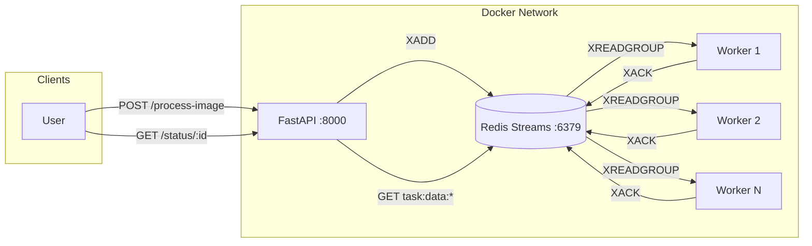
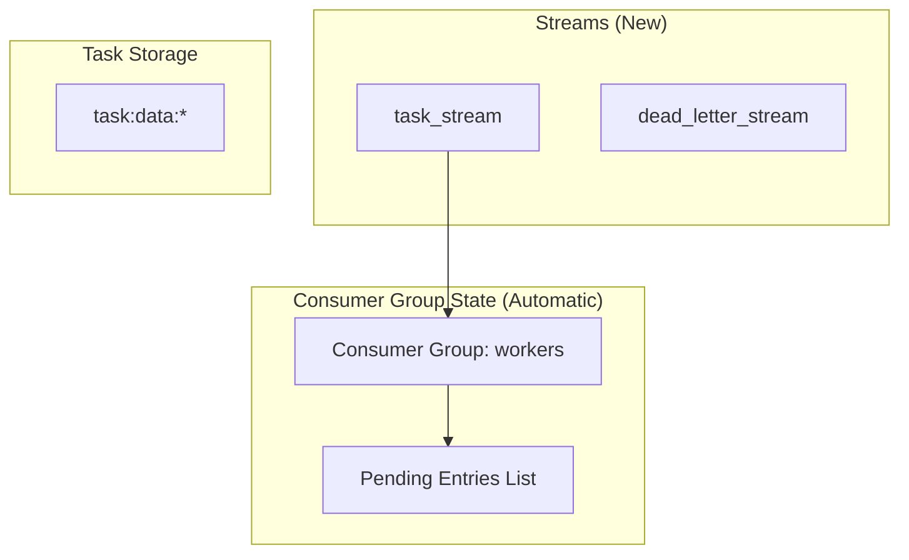
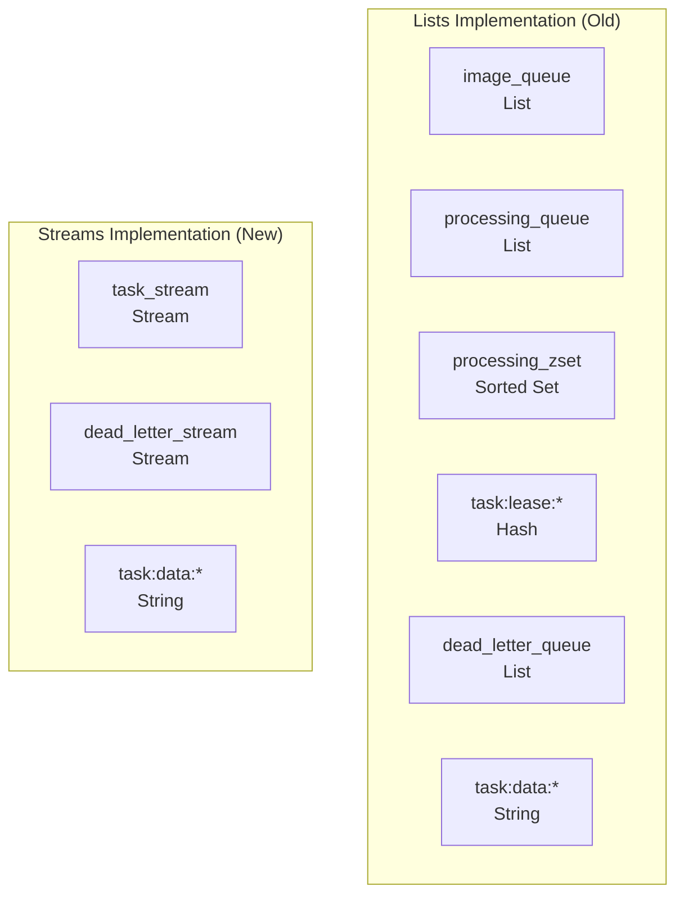
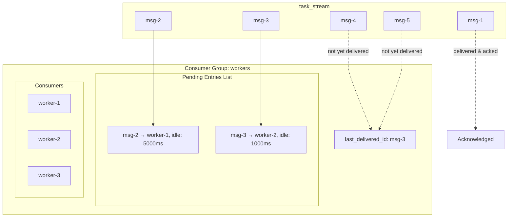
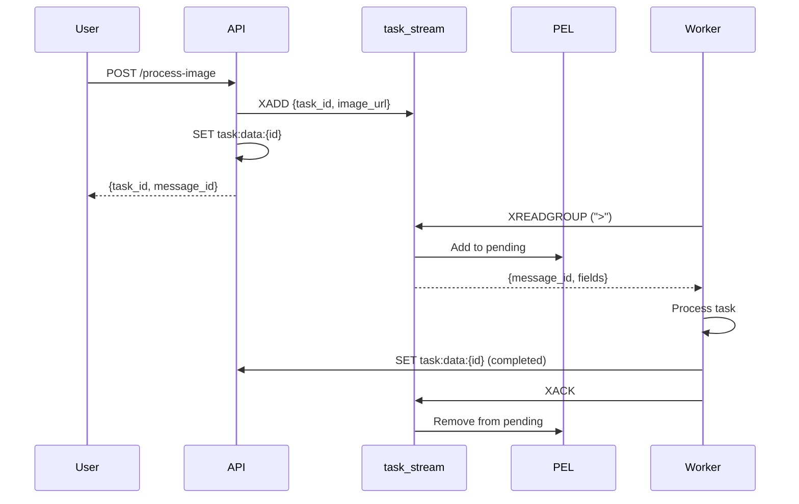
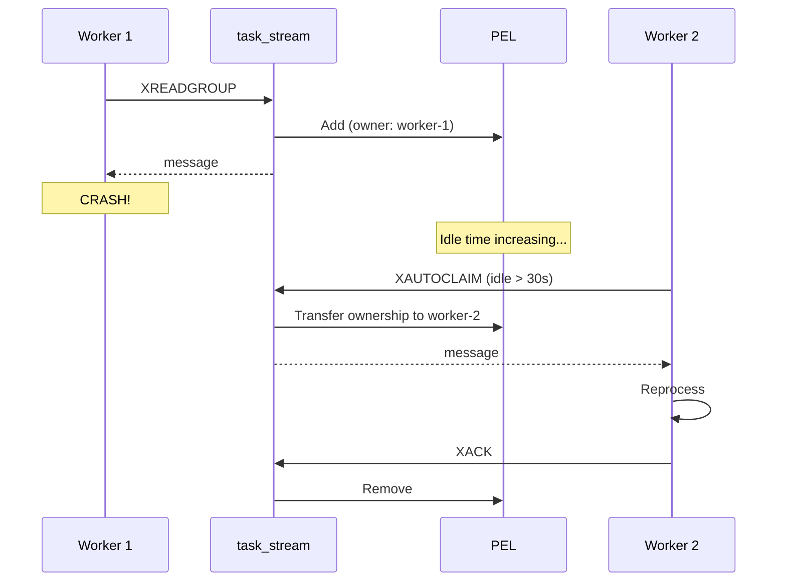
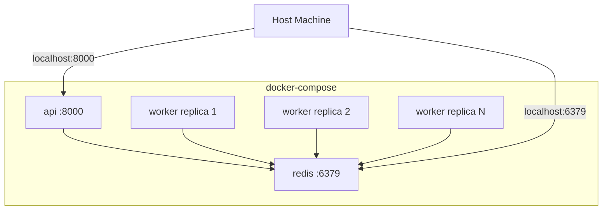
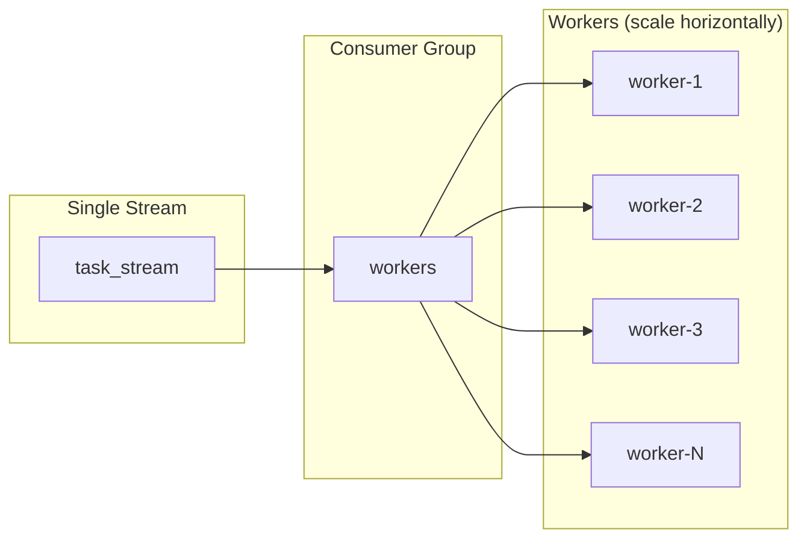

# System Architecture

## Overview



## Component Responsibilities

| Component | Role | Key Operations |
|-----------|------|----------------|
| **FastAPI** | Producer | `XADD` to stream, serve status queries |
| **Redis Streams** | Message Broker | Stream storage, consumer group management, PEL tracking |
| **Workers** | Consumers | `XREADGROUP`, process tasks, `XACK`, `XAUTOCLAIM` |

## Redis Data Structures



| Key | Type | Purpose |
|-----|------|---------|
| `task_stream` | Stream | Main task queue |
| `dead_letter_stream` | Stream | Failed tasks after max retries |
| `task:data:{id}` | String (JSON) | Task status and payload |

### Comparison: Lists vs Streams Data Structures



**Eliminated by Streams**:
- `processing_queue` → Replaced by PEL (Pending Entries List)
- `processing_zset` → Replaced by automatic idle time tracking
- `task:lease:*` → Replaced by consumer ownership in consumer group

## Consumer Group Architecture



## Message Flow

### Happy Path



### Failure Recovery Path



## Docker Compose Structure



```yaml
services:
  redis:
    image: redis:alpine
    command: redis-server --appendonly yes
    volumes:
      - redis_data:/data
    
  api:
    build: ./app
    depends_on: [redis]
    environment:
      - REDIS_HOST=redis
    
  worker:
    build: ./worker
    depends_on: [redis]
    stop_grace_period: 30s
    deploy:
      replicas: 3  # or use --scale worker=3
```

## Scaling Model



**Key Properties**:
- Each message delivered to exactly ONE consumer in the group
- Automatic load distribution
- No coordination needed between workers
- Workers can join/leave dynamically
