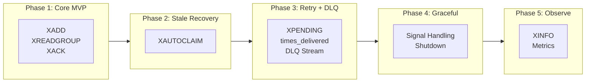
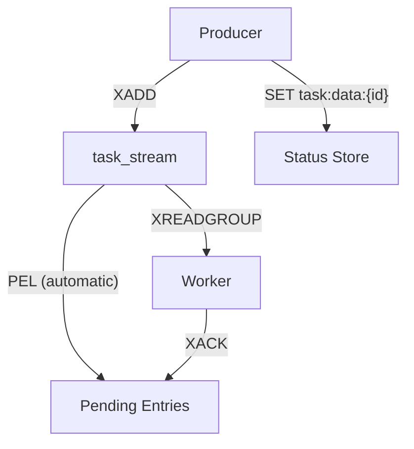
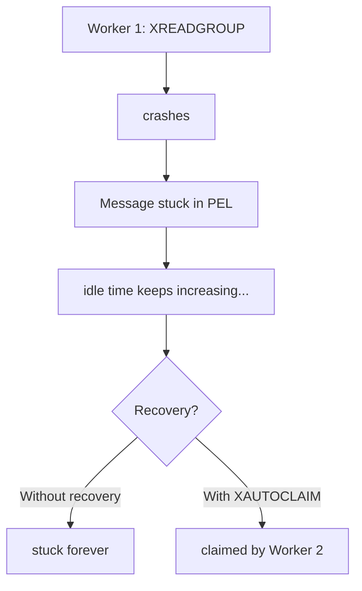
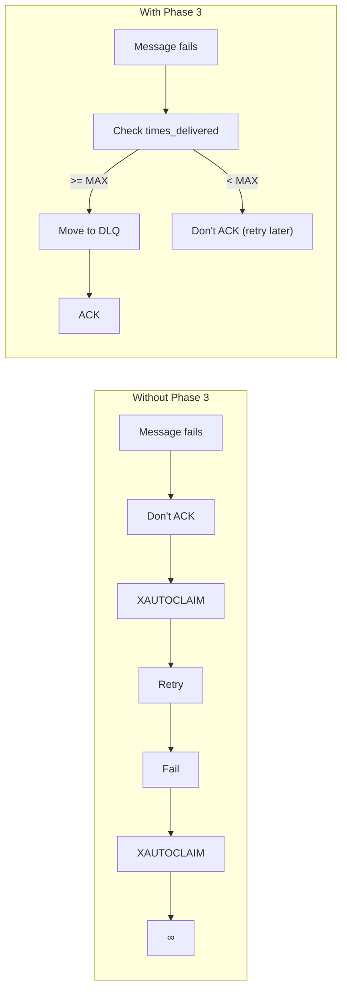
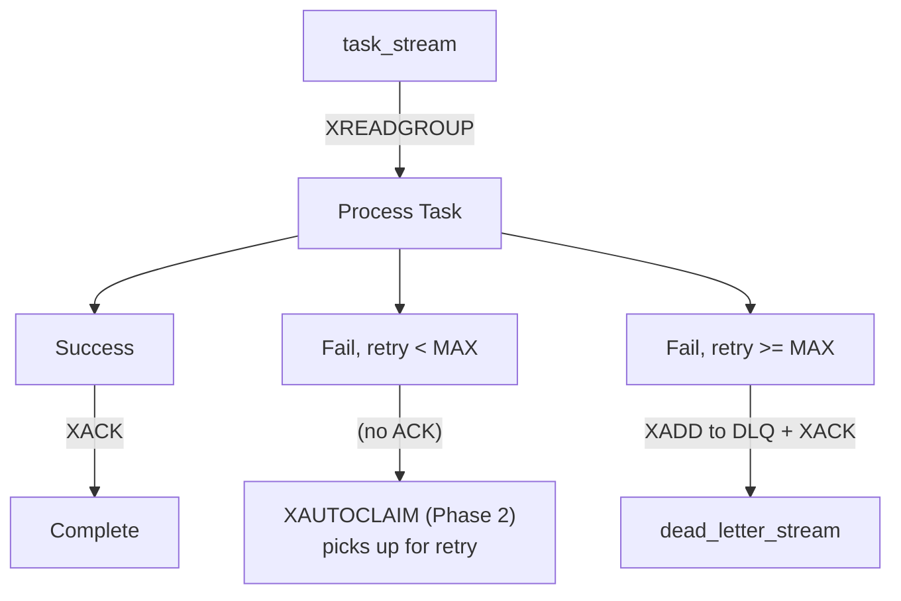
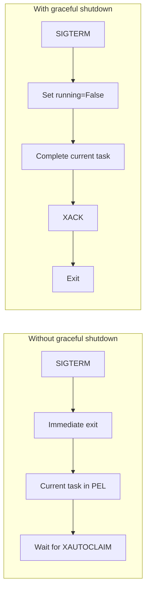
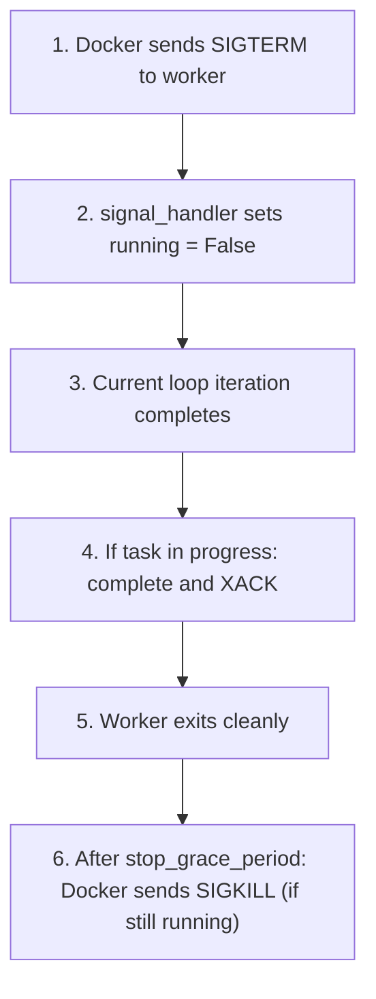

# Implementation Roadmap

## Overview

This document outlines the phased implementation approach, from basic working system to production-ready task queue.



---

## Phase 1: Core Stream Implementation

### Goal

Get a minimal working task queue with Redis Streams.

### What We Build

| Component          | Description                         |
| ------------------ | ----------------------------------- |
| **Producer**       | FastAPI endpoint using `XADD`       |
| **Consumer Group** | Initialize on worker startup        |
| **Worker Loop**    | `XREADGROUP` to claim tasks         |
| **Acknowledgment** | `XACK` on completion                |
| **Task Storage**   | `task:data:{id}` for status queries |

### What We Intentionally Skip

- [ ] Stale message recovery (Phase 2)
- [ ] Retry counting (Phase 3)
- [ ] Dead letter queue (Phase 3)
- [ ] Graceful shutdown (Phase 4)
- [ ] Monitoring endpoints (Phase 5)

### Architecture



### Key Files

```
worker/
├── stream_manager.py    # Basic: claim_task(), ack()
├── worker.py            # Simple while loop
├── config.py            # Stream name, group name, timeouts
└── task_processor.py    # Process logic (reuse from Lists project)
```

### Success Criteria

- [x] Can submit task via API
- [x] Worker receives and processes task
- [x] Task status updates correctly
- [x] Multiple workers share workload

### Known Limitations (To Address Later)

1. Worker crash = message stuck in PEL forever
2. No retry limit = infinite retries possible
3. No graceful shutdown = abrupt termination
4. No visibility into queue state

### Interview Discussion Points

- What happens when `XREADGROUP` is called with `">"`?
- Where does the message go after `XREADGROUP`?
- What is the Pending Entries List (PEL)?
- How does this compare to `BLMOVE` in Lists?

---

## Phase 2: Stale Message Recovery

### Goal

Automatically recover messages from crashed/slow workers.

### What We Add

| Component          | Description                             |
| ------------------ | --------------------------------------- |
| **XAUTOCLAIM**     | Claim messages idle > threshold         |
| **Recovery Loop**  | Check for stale messages in worker loop |
| **Idle Threshold** | Configurable visibility timeout         |

### Problem Being Solved



### Implementation

```python
# stream_manager.py
def recover_stale_messages(self, min_idle_ms: int = 30000) -> list:
    """
    XAUTOCLAIM: Find messages pending > min_idle_ms and claim them.

    This replaces the entire reaper.py from Lists implementation!
    """
    result = r.xautoclaim(
        self.stream,
        self.group,
        self.consumer,
        min_idle_time=min_idle_ms,
        start_id="0-0",
        count=10
    )
    return result[1] if result else []
```

```python
# worker.py - Modified loop
while running:
    # First: check for stale messages
    stale = manager.recover_stale_messages()
    for msg_id, fields in stale:
        process_message(manager, msg_id, fields)

    # Then: get new messages
    msg_id, fields = manager.claim_task()
    if msg_id:
        process_message(manager, msg_id, fields)
```

### Comparison to Lists

| Lists Reaper                  | Streams XAUTOCLAIM          |
| ----------------------------- | --------------------------- |
| 135 lines of Python           | 5 lines                     |
| 2 Lua scripts                 | 0 Lua scripts               |
| ZRANGEBYSCORE + manual claim  | Single atomic command       |
| Custom lease token generation | Consumer ownership built-in |
| Orphan recovery needed        | Not needed                  |

### Success Criteria

- [x] Crashed worker's messages recovered by another worker
- [x] Configurable idle threshold
- [x] No duplicate processing (ownership transfer is atomic)

### Interview Discussion Points

- How does `XAUTOCLAIM` differ from manual lease token approach?
- What does "idle time" mean in the context of PEL?
- Why is there no TOCTOU race in `XAUTOCLAIM`?

---

## Phase 3: Retry Logic & Dead Letter Queue

### Goal

Bounded retries with failed message preservation.

### What We Add

| Component              | Description                            |
| ---------------------- | -------------------------------------- |
| **Delivery Count**     | Track via `XPENDING` `times_delivered` |
| **Max Retries**        | Configurable threshold                 |
| **Dead Letter Stream** | Separate stream for failed messages    |
| **Failure Handling**   | Route to DLQ after max retries         |

### Problem Being Solved



### Delivery Count Tracking

```python
# Automatic! Redis tracks this for us
def get_delivery_count(self, message_id: str) -> int:
    pending = r.xpending_range(
        self.stream, self.group,
        min=message_id, max=message_id, count=1
    )
    return pending[0]['times_delivered'] if pending else 1
```

### Dead Letter Stream

```python
def move_to_dlq(self, message_id: str, fields: dict, error: str):
    DLQ_STREAM = "dead_letter_stream"

    # Add to DLQ with context
    r.xadd(DLQ_STREAM, {
        **fields,
        "error": error,
        "original_msg_id": message_id,
        "failed_at": str(time.time()),
    })

    # ACK original (removes from PEL)
    self.ack(message_id)
```

### Flow Diagram



### Success Criteria

- [x] Retry count tracked automatically (via `XPENDING` `times_delivered`)
- [x] Messages move to DLQ after max retries (configurable `MAX_RETRIES`)
- [x] DLQ preserves error context (original message ID, error, timestamp, consumer)
- [x] Can inspect/replay DLQ messages (stored in `dead_letter_stream`)

### Interview Discussion Points

- How does `times_delivered` increment?
- Why use a Stream for DLQ instead of a List?
- What are idempotency considerations for retried tasks?

---

## Phase 4: Graceful Shutdown

### Goal

Clean worker termination without message loss.

### What We Add

| Component              | Description                       |
| ---------------------- | --------------------------------- |
| **Signal Handlers**    | Catch SIGTERM, SIGINT             |
| **Running Flag**       | Control main loop                 |
| **Task Completion**    | Finish current task before exit   |
| **Docker Integration** | `stop_grace_period` configuration |

### Problem Being Solved



### Implementation

```python
import signal

running = True

def signal_handler(signum, frame):
    global running
    print(f"Received signal {signum}, shutting down...")
    running = False

def start_worker():
    signal.signal(signal.SIGINT, signal_handler)
    signal.signal(signal.SIGTERM, signal_handler)

    manager = StreamManager()

    while running:
        # Recovery + claim + process
        msg_id, fields = manager.claim_task()
        if msg_id:
            process_message(manager, msg_id, fields)

    print("Worker stopped gracefully")
```

### Docker Integration

```yaml
# docker-compose.yml
services:
  worker:
    build: ./worker
    stop_grace_period: 30s # Time to complete current task
```

### Shutdown Sequence



### Success Criteria

- [x] Worker completes current task on shutdown (signal handler sets `running=False`, loop exits after current task)
- [x] No messages left in indeterminate state (task is fully processed and ACKed before exit)
- [x] Clean exit logs (`"Worker {CONSUMER_NAME} stopped gracefully"`)
- [x] Works with Docker Compose (`stop_grace_period: 30s` configured)

### Interview Discussion Points

- Why is graceful shutdown important?
- What happens if task takes longer than `stop_grace_period`?
- How does this differ from crash recovery (Phase 2)?

---

## Phase 5: Observability & Monitoring

### Goal

Production-ready visibility into queue health.

### What We Add

| Component           | Description                                    |
| ------------------- | ---------------------------------------------- |
| **Stream Info**     | `XINFO STREAM` - queue depth, first/last entry |
| **Group Info**      | `XINFO GROUPS` - pending count, consumers      |
| **Consumer Info**   | `XINFO CONSUMERS` - per-worker metrics         |
| **Pending Details** | `XPENDING` - detailed pending entries          |
| **Health Endpoint** | FastAPI `/health` with all metrics             |

### Metrics Available

```python
# Stream level
stream_info = {
    "length": 150,                    # Current queue depth
    "first_entry": "1708000001234-0", # Oldest message
    "last_entry": "1708001234567-0",  # Newest message
    "groups": 1,                       # Number of consumer groups
}

# Consumer group level
group_info = {
    "name": "workers",
    "pending": 5,                      # Messages awaiting ACK
    "consumers": 3,                    # Active consumers
    "last_delivered_id": "...",        # Latest delivered message
}

# Per-consumer level
consumer_info = [
    {"name": "worker-abc", "pending": 2, "idle": 1500},
    {"name": "worker-def", "pending": 2, "idle": 800},
    {"name": "worker-ghi", "pending": 1, "idle": 200},
]

# Detailed pending (for debugging)
pending_details = [
    {"message_id": "...", "consumer": "worker-abc",
     "idle_ms": 45000, "times_delivered": 2},
]
```

### Health Endpoint

```python
@app.get("/health")
def health():
    return {
        "stream": get_stream_info(),
        "group": get_group_info(),
        "consumers": get_consumer_info(),
        "alerts": check_alerts(),
    }

def check_alerts():
    alerts = []

    # Alert: high pending count
    if group_info["pending"] > 100:
        alerts.append("HIGH_PENDING_COUNT")

    # Alert: stale messages
    for p in pending_details:
        if p["idle_ms"] > 60000:
            alerts.append(f"STALE_MESSAGE_{p['message_id']}")

    # Alert: idle consumers
    for c in consumer_info:
        if c["idle"] > 300000:  # 5 minutes
            alerts.append(f"IDLE_CONSUMER_{c['name']}")

    return alerts
```

### Comparison to Lists

| Metric         | Lists Implementation    | Streams                      |
| -------------- | ----------------------- | ---------------------------- |
| Queue depth    | `LLEN image_queue`      | `XINFO STREAM`               |
| Pending count  | `ZCARD processing_zset` | `XINFO GROUPS` → pending     |
| Per-consumer   | Not available           | `XINFO CONSUMERS`            |
| Delivery count | Manual tracking         | `XPENDING` → times_delivered |
| Message age    | Manual tracking         | Message ID timestamp         |

### Success Criteria

- [x] `/health` endpoint returns comprehensive metrics (stream, group, consumers, pending details, alerts)
- [x] Can identify slow consumers (via `XINFO CONSUMERS` per-worker pending and idle time)
- [x] Can detect stale messages (via `XPENDING` idle_ms and alert thresholds)
- [x] Ready for Prometheus/Grafana integration (structured response with configurable thresholds)

### Interview Discussion Points

- What metrics indicate an unhealthy queue?
- How do you detect consumer lag?
- What's the difference between queue depth and pending count?

---

## Phase 6: Production Hardening (Optional)

### Goal

Scale and reliability optimizations.

### Potential Additions

| Feature                | Description                              |
| ---------------------- | ---------------------------------------- |
| **Stream Trimming**    | `XADD ... MAXLEN ~10000` to bound memory |
| **Batch Processing**   | `XREADGROUP ... count=10` for throughput |
| **Connection Pooling** | Reuse Redis connections                  |
| **Persistence Config** | Redis AOF for durability                 |
| **Metrics Export**     | Prometheus format metrics                |

### Not In Scope (Intentionally)

- Redis Cluster (adds complexity for demo)
- Redis Sentinel (HA is infrastructure concern)
- Custom message serialization (JSON is fine)
- Multiple stream partitioning (single stream sufficient)

---

## Summary

| Phase | Focus         | Key Commands                 | Code Added |
| ----- | ------------- | ---------------------------- | ---------- |
| 1     | Core MVP      | `XADD`, `XREADGROUP`, `XACK` | ~200 lines |
| 2     | Recovery      | `XAUTOCLAIM`                 | +40 lines  |
| 3     | Retry/DLQ     | `XPENDING`, DLQ stream       | +60 lines  |
| 4     | Shutdown      | Signal handling              | +30 lines  |
| 5     | Observability | `XINFO` commands             | +50 lines  |
| 6     | Hardening     | Trimming, batching           | +50 lines  |

**Total**: ~430 lines (vs ~600 in Lists implementation)
