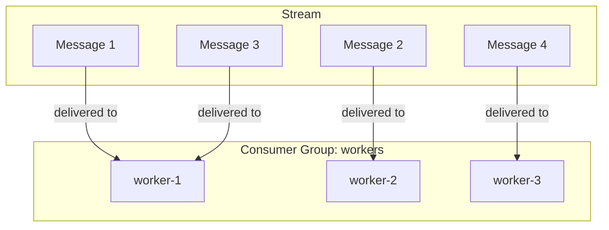
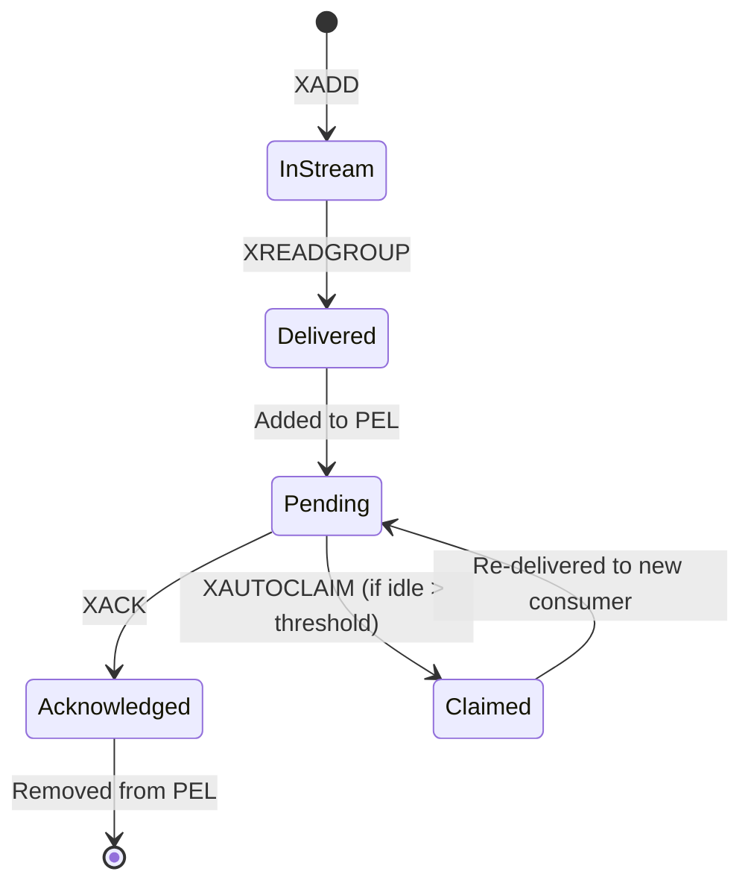

# Redis Streams Concepts

## What is a Redis Stream?

A **Stream** is an append-only log data structure in Redis. Think of it as a combination of:

- A **list** (ordered sequence of messages)
- A **pub/sub channel** (multiple consumers can read)
- A **persistent queue** (messages retained until explicitly deleted)

```
┌─────────────────────────────────────────────────────────────────┐
│                        task_stream                              │
├─────────────────────────────────────────────────────────────────┤
│  1708000001000-0  │  1708000002000-0  │  1708000003000-0  │ ... │
│  {task_id: "a1"}  │  {task_id: "b2"}  │  {task_id: "c3"}  │     │
└─────────────────────────────────────────────────────────────────┘
        ▲                                                    ▲
     oldest                                               newest
     (first)                                              (last)
```

## Message ID Structure

Every message has a unique ID: `<millisecondsTime>-<sequenceNumber>`

```
1708000001234-0
│             │
│             └── Sequence number (0, 1, 2... for same millisecond)
└──────────────── Unix timestamp in milliseconds
```

**Properties**:

- Automatically generated by Redis (or can be specified)
- Guaranteed unique and monotonically increasing
- Can be used for time-based queries
- Used for acknowledgment

## Core Operations

### XADD - Add Message to Stream

```
XADD task_stream * task_id "abc123" image_url "cat.jpg"
       │          │    │
       │          │    └── Field-value pairs (message content)
       │          └──────── "*" = auto-generate ID
       └─────────────────── Stream name
```

Returns: `"1708000001234-0"` (the generated message ID)

### XREAD - Read Messages (Simple)

```
XREAD BLOCK 1000 STREAMS task_stream 0
                           │         │
                           │         └── Start from ID "0" (beginning)
                           └───────────── Stream name
```

**Note**: Simple read without consumer groups. Each reader gets ALL messages.

### XREADGROUP - Read with Consumer Group

```
XREADGROUP GROUP workers worker-1 BLOCK 1000 STREAMS task_stream >
              │      │                                          │
              │      └── Consumer name (unique per worker)      │
              └─────────── Group name                           │
                                                                │
                            ">" means: only NEW undelivered messages
```

**Key Difference**: Each message delivered to exactly ONE consumer in the group.

### XACK - Acknowledge Message

```
XACK task_stream workers 1708000001234-0
        │           │           │
        │           │           └── Message ID to acknowledge
        │           └──────────────── Group name
        └──────────────────────────── Stream name
```

Removes message from Pending Entries List (PEL).

### XPENDING - Inspect Pending Messages

```
XPENDING task_stream workers
```

Returns:

```
1) (integer) 3                     # Total pending messages
2) "1708000001234-0"               # Smallest pending ID
3) "1708000003456-0"               # Largest pending ID
4) 1) 1) "worker-1"                # Per-consumer breakdown
      2) "2"
   2) 1) "worker-2"
      2) "1"
```

### XAUTOCLAIM - Claim Stale Messages

```
XAUTOCLAIM task_stream workers worker-2 30000 0-0
              │           │        │      │    │
              │           │        │      │    └── Start scanning from
              │           │        │      └─────── Min idle time (ms)
              │           │        └────────────── New owner
              │           └─────────────────────── Group name
              └─────────────────────────────────── Stream name
```

Finds messages pending > 30 seconds and transfers ownership to worker-2.

## Consumer Groups

### What is a Consumer Group?

A consumer group is a way to distribute stream messages among multiple consumers, where:

- Each message goes to exactly ONE consumer
- Messages are tracked until acknowledged
- Failed messages can be claimed by other consumers



### Consumer Group State

```
┌─────────────────────────────────────────────────────────────────┐
│                   Consumer Group: "workers"                     │
├─────────────────────────────────────────────────────────────────┤
│  last_delivered_id: 1708000003456-0                             │
│                                                                 │
│  Pending Entries List (PEL):                                    │
│  ┌───────────────────┬───────────┬──────────┬─────────────────┐ │
│  │ Message ID        │ Consumer  │ Idle (ms)│ Times Delivered │ │
│  ├───────────────────┼───────────┼──────────┼─────────────────┤ │
│  │ 1708000001234-0   │ worker-1  │ 45000    │ 2               │ │
│  │ 1708000002345-0   │ worker-2  │ 12000    │ 1               │ │
│  │ 1708000003456-0   │ worker-1  │ 5000     │ 1               │ │
│  └───────────────────┴───────────┴──────────┴─────────────────┘ │
│                                                                 │
│  Consumers:                                                     │
│  - worker-1: 2 pending, idle 5000ms                             │
│  - worker-2: 1 pending, idle 12000ms                            │
│  - worker-3: 0 pending, idle 100ms                              │
└─────────────────────────────────────────────────────────────────┘
```

### Pending Entries List (PEL)

The PEL tracks:

- **Message ID**: Which message is pending
- **Consumer**: Who received it
- **Delivery Time**: When it was delivered
- **Delivery Count**: How many times delivered (for retry tracking)

This is what enables recovery - if a consumer crashes, its pending messages can be claimed by another consumer.

## The ">" Special ID

When using `XREADGROUP`:

| ID                | Meaning                                        |
| ----------------- | ---------------------------------------------- |
| `>`               | Only messages never delivered to ANY consumer  |
| `0`               | All messages, including already-delivered ones |
| `1708000001234-0` | Messages after this specific ID                |

**Typical pattern**:

1. Normal loop: `XREADGROUP ... >` (get new messages)
2. Recovery: `XAUTOCLAIM ...` (get stale messages from other consumers)

## Message Lifecycle



## Stream vs List Behavior

| Behavior           | List                | Stream                            |
| ------------------ | ------------------- | --------------------------------- |
| Read message       | `BRPOP` removes it  | `XREADGROUP` keeps it (until ACK) |
| Message after read | Gone from Redis     | Still in stream                   |
| Consumer crash     | Message lost        | Message recoverable from PEL      |
| Delivery tracking  | Manual (sorted set) | Automatic (PEL)                   |
| Retry counting     | Manual              | Automatic `times_delivered`       |

## Key Advantages for Task Queues

1. **No Race Window**: `XREADGROUP` atomically delivers AND tracks
2. **Automatic Recovery**: PEL + `XAUTOCLAIM` handles crashes
3. **Built-in Retry Count**: `times_delivered` increments automatically
4. **Message History**: Can replay from any point
5. **Observability**: `XINFO` commands for monitoring
